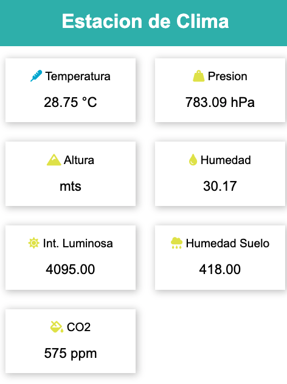
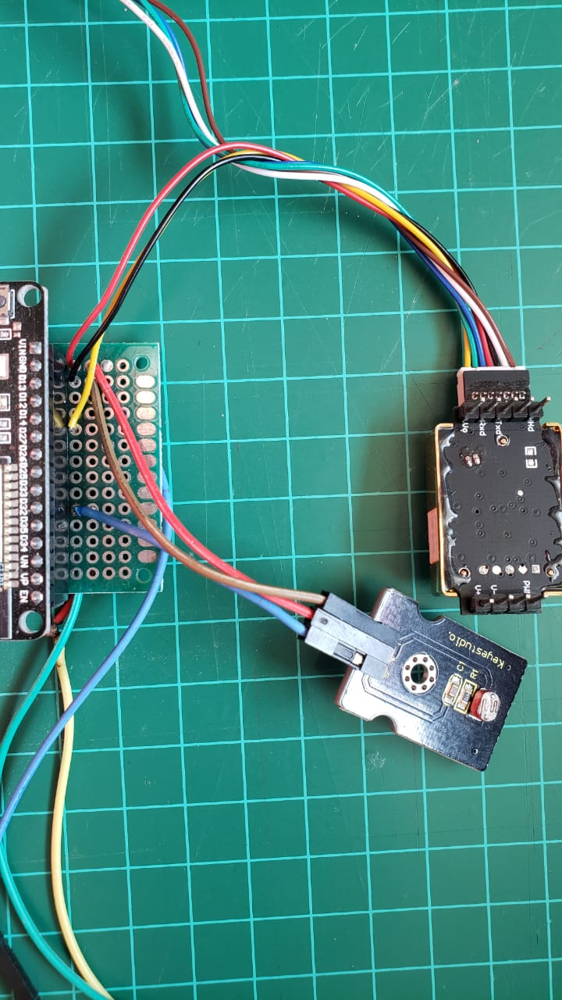
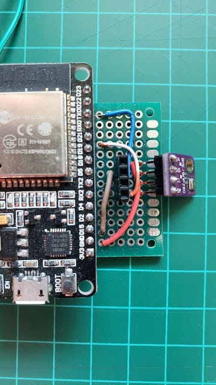

# CO2 Sensor with Esp32 and AWS IoT

This Repository shows how to create an CO2 Sensor with temperature and presure to understand if a place need more ventilation. <br>
This project use ESP32 to show data using a web page but also send all data to AWS IoT Core in order to get more data for analytics. This device could be use to sense if a room is to close in order to avoid possible COVIT-19 infections.<br>
For this project I'm using MHZ-19 to sense CO2, that use an infrared technology and is very accurate with the readings. For temperature, the sensor is BME280 that is a very small device easy to use.
ESP32 allow us to publish this data on local Web page that is possible to access if you are in the same WiFi. To get data and be able to run analytics is possible to send all information to AWS IoT with the right topics and then use Amazon Athena to get reports and more insights without running servers.
<br><br>
The following links allow to set-up the ESP32 device to work with AWS IoT Core
https://github.com/aws-samples/aws-iot-workshop


<br><br>

Here is WEB page:



<br><br>
This is the MHZ-19 Sensor<br>


<br><br>
This is the BME280 Sensor<br>

<br>

The code could be devide on 3 parts: the web page, the sensors and AWS IoT data.<br><br>

## The web Page
We will use the library <ESPAsyncWebServer.h> to do this. This web page has a lot of examples to use it: [Randomnerttutorials.com](https://randomnerdtutorials.com/esp32-web-server-with-bme280-mini-weather-station/)<br>
The code for the page is the follow:

```c
const char index_html[] PROGMEM = R"rawliteral(
<!DOCTYPE HTML><html>
<head>
  <title>Weather Station</title>
  <meta name="viewport" content="width=device-width, initial-scale=1">
  <link rel="stylesheet" href="https://use.fontawesome.com/releases/v5.7.2/css/all.css" integrity="sha384-fnmOCqbTlWIlj8LyTjo7mOUStjsKC4pOpQbqyi7RrhN7udi9RwhKkMHpvLbHG9Sr" crossorigin="anonymous">
  <link rel="icon" href="data:,">
  <style>
    html {font-family: Arial; display: inline-block; text-align: center;}
    p { font-size: 1.2rem;}
    body {  margin: 0;}
    .topnav { overflow: hidden; background-color: #50B8B4; color: white; font-size: 1rem; }
    .content { padding: 20px; }
    .card { background-color: white; box-shadow: 2px 2px 12px 1px rgba(140,140,140,.5); }
    .cards { max-width: 800px; margin: 0 auto; display: grid; grid-gap: 2rem; grid-template-columns: repeat(auto-fit, minmax(200px, 1fr)); }
    .reading { font-size: 1.4rem; }
  </style>
</head>
<body>
  <div class="topnav">
    <h1>Estacion de Clima </h1>  
  </div>
  <div class="content">
    <div class="cards">
      <div class="card">
        <p><i class="fas fa-thermometer" style="color:#00add6;"></i> Temperatura</p><p><span class="reading"><span id="temp">%temp%</span> &deg;C</span></p>
      </div>
      <div class="card">
        <p><i class="fas fa-weight-hanging" style="color:#e1e437;"></i> Presion</p><p><span class="reading"><span id="presion">%presion%</span> hPa</span></p>
      </div>
      <div class="card">
        <p><i class="fas fa-mountain" style="color:#e1e437;"></i> Altura</p><p><span class="reading"><span id="altitud">%f_pressu%</span> mts</span></p>
      </div>
      <div class="card">
        <p><i class="fas fa-tint" style="color:#e1e437;"></i> Humedad</p><p><span class="reading"><span id="hum">%hum%</span> </span></p>
      </div>
      <div class="card">
        <p><i class="fas fa-sun" style="color:#e1e437;"></i> Int. Luminosa</p><p><span class="reading"><span id="luz">%luz%</span> </span></p>
      </div>
      <div class="card">
        <p><i class="fas fa-cloud-rain" style="color:#e1e437;"></i> Humedad Suelo</p><p><span class="reading"><span id="soil">%soil%</span> </span></p>
      </div>
      <div class="card">
        <p><i class="fas fa-fill-drip" style="color:#e1e437;"></i> CO2</p><p><span class="reading"><span id="co2">%co2%</span> ppm</span></p>
      </div>
      
    </div>
  </div>
<script>
if (!!window.EventSource) {
 var source = new EventSource('/events');
 
 source.addEventListener('open', function(e) {
  console.log("Events Connected");
 }, false);
 source.addEventListener('error', function(e) {
  if (e.target.readyState != EventSource.OPEN) {
    console.log("Events Disconnected");
  }
 }, false);
 source.addEventListener('message', function(e) {
  console.log("message", e.data);
 }, false);
 source.addEventListener('temp', function(e) {
  console.log("temp", e.data);
  document.getElementById("temp").innerHTML = e.data;
 }, false);
 source.addEventListener('presion', function(e) {
  console.log("presion", e.data);
  document.getElementById("presion").innerHTML = e.data;
 }, false);
  source.addEventListener('altitud', function(e) {
  console.log("altitud", e.data);
  document.getElementById("altitud").innerHTML = e.data;
 }, false);
  source.addEventListener('hum', function(e) {
  console.log("hum", e.data);
  document.getElementById("hum").innerHTML = e.data;
 }, false);
  source.addEventListener('luz', function(e) {
  console.log("luz", e.data);
  document.getElementById("luz").innerHTML = e.data;
 }, false);
  source.addEventListener('soil', function(e) {
  console.log("soil", e.data);
  document.getElementById("soil").innerHTML = e.data;
 }, false);
  source.addEventListener('co2', function(e) {
  console.log("co2", e.data);
  document.getElementById("co2").innerHTML = e.data;
 }, false);
}


</script>
</body>
</html>)rawliteral";

```
As you can notice, we put the web code inside a variable to build it. Also have javascript functions that will be executed in the browser. All sensor data are variables used like this inside the HTML code:

```c
%temp%
```
Inside the SETUP we create the web Server with this code:

```c
 // Handle Web Server
  server.on("/", HTTP_GET, [](AsyncWebServerRequest *request){
    request->send_P(200, "text/html", index_html, processor);
  });

  // Handle Web Server Events
  events.onConnect([](AsyncEventSourceClient *client){
    if(client->lastId()){
      Serial.printf("Client reconnected! Last message ID that it got is: %u\n", client->lastId());
    }
    // send event with message "hello!", id current millis
    // and set reconnect delay to 1 second
    client->send("hello!", NULL, millis(), 10000);
  });
  server.addHandler(&events);
  server.begin();
```
In the LOOP function we will pass sensors data to web page variables:
```c
// Send Events to the Web Server with the Sensor Readings
    events.send("ping",NULL,millis());
    events.send(String(f_temp).c_str(),"temp",millis());
    events.send(String(f_pressu).c_str(),"presion",millis());
    events.send(String(f_altid).c_str(),"altitud",millis());
    events.send(String(f_hum).c_str(),"hum",millis());
    events.send(String(f_luz).c_str(),"luz",millis());
    events.send(String(f_piso).c_str(),"soil",millis());
    events.send(String(i_co2_pwm).c_str(),"co2",millis());
```

## The Sensors

First we will use two libraries for BME280 :
```c
#include <Adafruit_Sensor.h>
#include <Adafruit_BME280.h>
```

The code for is BME inside SETUP:

  ```c
  // Starts BME
  if (!bme.begin(0x76)) {
    Serial.println("Could not find a valid BME280 sensor, check wiring!");
    while (1);
  }
```
The function to read the sensor
```c
void ReadBME()
{
  
  f_temp = bme.readTemperature();
  f_pressu = bme.readPressure() / 100.0F;
  f_altid = bme.readAltitude(SEALEVELPRESSURE_HPA);
  f_hum = bme.readHumidity();
}
```


For the MHZ-19 here is the [Link](https://github.com/tobiasschuerg/MH-Z-CO2-Sensors) library, <br>
I tested other libraries and this one is simple to use with the PWM. Is important to mention that MHZ-19 is able to get data also with RX/TX pins but I had better results using the PWM. 


The MHZ-19 is need to preheat before start working. This process takes like 5 min. An need to be done in the SETUP part. 
```c
// Preheating CO2
 if (co2.isPreHeating()) {
    Serial.print("Preheating");
    while (co2.isPreHeating()) {
      Serial.print(".");
      delay(5000);
    }
    Serial.println();
  }
```

And here is the code to read the MHZ-19:

```c
// Read CO2
void leerco2()
{
  i_co2_uart = co2.readCO2UART();
  Serial.print("PPMuart: ");

  if (i_co2_uart > 0) {
    Serial.print(i_co2_uart);
  } else {
    Serial.print("n/a");
  }

  i_co2_pwm = co2.readCO2PWM();
  Serial.print(", PPMpwm: ");
  Serial.print(i_co2_pwm);

}
```


## Send Data to AWS IoT Core

Is important to prepare AWS IoT Core to be ready to get data these steps are:
- Create a thing
- Create certificates for this device
- Create a Policy in order to put data or publish
- Create AWS IoT Rules to put messages on S3 or DynamoDB
This link is very useful to do this:<br>
https://github.com/aws-samples/aws-iot-workshop <br><br>

If you have AWS IoT communication all set, sending topics is quite easy. <br>
First create the Topic string:

```C
    // Create the Topic string
    //   f_temp, f_pressu, f_altid, f_hum, f_luz, f_piso, f_agua;
    // "{ \"C02\":%s,\"TI\":%s,\"TE\":%s,\"Al\":%s}"
    payload = "{\"time\":";
    payload += timeClient.getEpochTime();
    payload += ",\"Temp\":";
    payload += String(f_temp).c_str();
    payload += ",\"Hum\":";
    payload += String(f_hum).c_str();
    payload += ",\"Press\":";
    payload += String(f_pressu).c_str();
    payload += ",\"Luz\":";
    payload += String(f_luz).c_str();
    payload += ",\"soil\":";
    payload += String(f_piso).c_str();
    payload += ",\"CO2\":";
    payload += String(i_co2_pwm).c_str();    
    payload += "}";
```
And then publish to AWS IoT 
```C
      if (iotclient.publish(TOPIC_NAME, (char*) payload.c_str() ))
        {
            Serial.println("Successfully posted");
        }
        else
        {
            Serial.println(String("Failed to post to MQTT"));
        }
```
After you have your messages on AWS IoT is very easy to run some queries on the topics using Amazon Athena.


